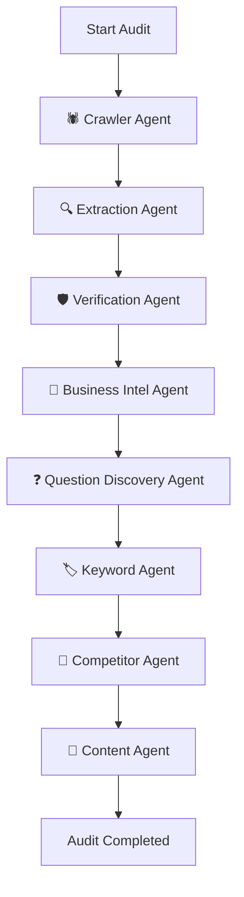

# 🏛️ GeoPilot / AIVOP System Architecture

This document provides a comprehensive technical overview of the system architecture, design patterns, data flows, and structural components of the **GeoPilot (AI Visibility Optimization Platform)**.

---

## 1. High-Level Architecture Overview

GeoPilot utilizes a decoupled, backend-first, multi-tenant architecture designed to crawled web sites, extract structured business profiles, verify claim factual accuracy, and simulate search agent inquiries to optimize visibility.

```
                  ┌───────────────────────────────┐
                  │       Customer Browser        │
                  └───────────────┬───────────────┘
                                  │
                                  ▼
         ┌──────────────────────────────────────────────────┐
         │     Next.js Frontend (TS + Vanilla CSS)          │
         │     - ErrorBoundary & Toast Contexts             │
         │     - Framer Motion micro-animations             │
         │     - Dynamic Workspace Switcher                 │
         └────────────────────────┬─────────────────────────┘
                                  │ HTTPS REST (Bearer JWT Auth)
                                  ▼
         ┌──────────────────────────────────────────────────┐
         │        FastAPI Backend API (Python)              │
         │     - Request-Scoped Supabase Client Proxy       │
         │     - 8-Router Modular Domain Architecture       │
         │     - Redis Caching Layer                        │
         └───────────────┬──────────────────┬───────────────┘
                         │                  │
         Trigger Tasks   │                  │ Query & Update
                         ▼                  ▼
      ┌─────────────────────┐    ┌─────────────────────┐
      │  Celery Task Queue  │    │  Supabase Postgres  │
      │  - Worker Pool      │    │  - App Schema       │
      │  - Redis Broker     │    │  - Row-Level RLS    │
      └──────────┬──────────┘    └─────────────────────┘
                 │
                 ▼
      ┌─────────────────────┐    ┌─────────────────────┐
      │  LangGraph Agent    │    │ Qdrant Vector Store │
      │  Orchestrator       │◄───┤ - Crawled Chunks    │
      │  - 8-Node Machine   │    │ - Semantic Index    │
      └─────────────────────┘    └─────────────────────┘
```

---

## 2. Decoupled Service Directory

*   **Next.js Frontend**: A high-fidelity, single-page dashboard executing in the browser, calling FastAPI backend routes dynamically. Styled using custom Vanilla CSS tokens, providing complete layout responsivity and modern dark-mode glassmorphic layouts.
*   **FastAPI Backend**: Provides stateless, request-scoped async controllers. Authenticates incoming JWT tokens using Supabase Auth, dynamically mapping request contexts to project resources.
*   **Supabase (PostgreSQL + Auth)**: Acts as the primary transactional storage engine. Utilizes Row-Level Security (RLS) policies based on user IDs to isolate workspace data.
*   **Redis**: Serves as the high-speed caching registry for endpoints and as the Celery asynchronous task broker.
*   **Celery Worker**: Manages background crawling and schedules LangGraph orchestrations to prevent blocking API execution loops.
*   **Qdrant**: Local vector database compiling crawled webpage text embeddings for fast semantic keyword matching and document retrieval.

---

## 3. LangGraph Orchestrated 8-Agent Network

The core analytical pipeline is modeled as a stateful, deterministic directed acyclic graph (DAG) managed via **LangGraph**:



### Node Specifications
1.  **Crawler Agent**: Recursively crawls up to 30 internal pages of the target URL, strips HTML boilerplate, hashes page content to remove duplicates, and indexes content chunks into Qdrant.
2.  **Extraction Agent**: Extracts core business statements, certifications, user testimonials, products, and features into structured JSON claims.
3.  **Verification Agent**: Audits extracted claims against raw crawled contexts. If a statement cannot be proven with verbatim page text, it is flagged as `NOT_FOUND` with confidence penalty.
4.  **Business Intelligence Agent**: Summarizes the brand positioning, compiles a SWOT matrix, and outputs high-level GEO improvement targets.
5.  **Question Discovery Agent**: Discovers conversational searches across Awareness, Consideration, Decision, and Purchase phases, creating optimized answer blueprints.
6.  **Keyword Agent**: Identifies short/long-tail search intents and groups them into semantic topical clusters.
7.  **Competitor Agent**: Benchmarks target keyword performance and citation overlaps against direct and indirect competitors.
8.  **Content Agent**: Generates highly relevant blog outlines using 100% verified facts to fill citation gaps.

---

## 4. Modular Router Refactoring

To guarantee high maintainability and prevent circular dependency traps, the backend router has been split from a single `analysis.py` file into **8 separate domain-driven sub-routers** under `backend/app/routers/`:

*   **`analysis_results.py`**: Serves aggregate dashboard data from the cache registry.
*   **`analysis_questions.py`**: Manages paginated question lists and priority intent scoring.
*   **`analysis_keywords.py`**: Manages keyword volumes, semantic tags, and search intents.
*   **`analysis_geo.py`**: Exposes generative engine visibility indices and citation probabilities.
*   **`analysis_analytics.py`**: Computes regression curves, heatmaps, competitor benchmarks, and historical run deltas.
*   **`analysis_reliability.py`**: Manages hallucination detection, consistency reports, and manual reality check verifications.
*   **`analysis_execution.py`**: Directs celery pipeline launches, checkpoints, run statuses, and task resumption triggers.
*   **`analysis_optimization.py`**: Tracks strategy roadmaps, ROI reports, and optimization roadmap histories.

All sub-routers mount under the `/analysis` prefix in `app/main.py`, preserving complete backward-compatibility with the frontend client.

---

## 5. Performance & Caching Strategy

GeoPilot utilizes **Redis** for endpoint response caching to ensure instant dashboard load times.
*   **Caching Key Format**: `aivop:cache:{project_id}:{domain}` (e.g., `aivop:cache:proj-123:analysis_results`).
*   **Granular Invalidation**: When a new analysis run executes successfully, the cache helper calls `invalidate_project_cache(project_id)`, running a glob scan to invalidate only the cache keys matching the specific project ID, leaving other users' caches untouched.
*   **Task Brokerage**: Celery routes crawler scraping runs into separate async loops, preventing API gatekeeper timeouts.
