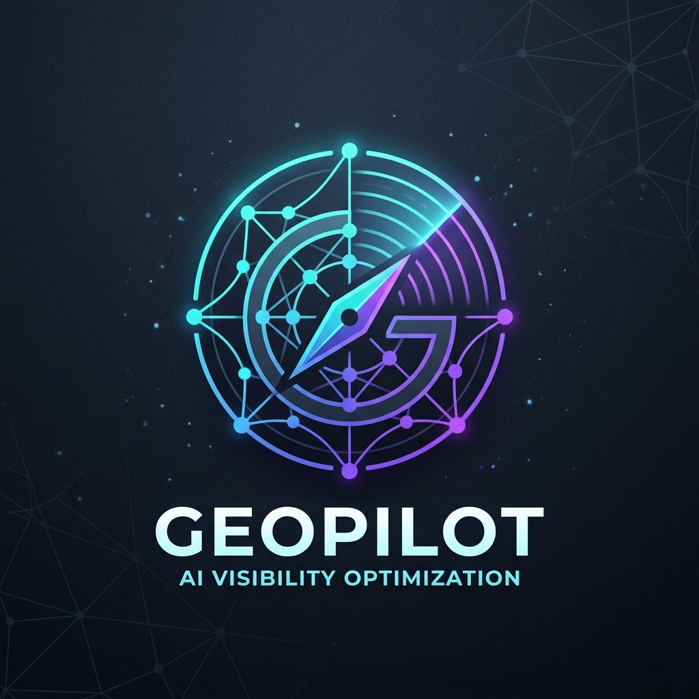
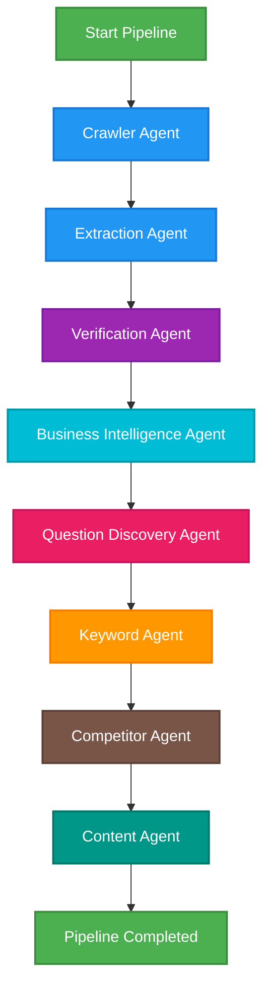

# 🌐 GeoPilot — AI Visibility Optimization Platform (AIVOP)

<p align="center">
  
</p>

<p align="center">
  <strong>Analyze, Simulate, and Dominate Your Brand Visibility Across Modern AI Search Engines</strong>
</p>

<p align="center">
  <a href="#-features"></a>
  <a href="https://fastapi.tiangolo.com"></a>
  <a href="https://nextjs.org"></a>
  <a href="https://supabase.com"></a>
  <a href="https://qdrant.tech"></a>
  <a href="https://redis.io"></a>
</p>

---

## 🚀 Welcome to the Future of Search

Search is evolving. Users are moving from listing pages of links to getting direct, conversational answers from LLMs (ChatGPT, Google Gemini, Perplexity). **GeoPilot (AIVOP)** is a state-of-the-art enterprise-grade SaaS platform that audits your site, crawls content, extracts facts, maps your knowledge graph, and runs AI simulation queries to **measure, verify, and improve your brand visibility in AI-generated answers.**

---

## ✨ Features at a Glance

*   🕵️‍♂️ **Multi-Stage Deep Crawl**: Asynchronous crawler parsing structured metadata and body copy into clean Markdown documents.
*   🧠 **LangGraph Orchestrated AI Pipeline**: A multi-agent framework managing complex dependency flows with 8 highly-specialized AI Agents.
*   🛡️ **Strict Evidence Verification**: Automatically verifies LLM claims against verbatim crawled context. Hallucination detection prevents false assertions.
*   ⚡ **High-Performance Caching**: Redis-backed cache layer with automatic TTL and intelligent, granular invalidation to keep the dashboard blazing-fast.
*   🔄 **Celery Background Processing**: Robust execution engine ensuring long-running crawls and analyses run flawlessly in the background, recovering instantly from transient errors.
*   📊 **Stunning Analytics Dashboard**: Premium dark-mode user interface built with Next.js App Router and Vanilla CSS for maximum performance and responsiveness.
*   🔒 **Row-Level Security (RLS)**: Strict enterprise security compliance isolating workspace project data on Supabase PostgreSQL.

---

## 🛠️ Tech Stack

### Backend (Python/FastAPI)
*   **FastAPI**: Blazing fast, high-performance web API framework.
*   **LangGraph & LangChain**: Advanced state machine and AI agent orchestration framework.
*   **Qdrant**: High-performance local vector database for fast semantic search and context retrieval.
*   **Redis**: Caching and Celery message broker.
*   **Celery**: Background task runner managing recursive crawler schedules and heavy analysis runs.
*   **Supabase PostgreSQL**: Multi-tenant database storage equipped with strict Row-Level Security (RLS).

### Frontend (TypeScript/Next.js)
*   **Next.js (App Router)**: Clean, modular architecture for lightning-fast server side rendering (SSR).
*   **Vanilla CSS**: Ultra-premium, sleek, dark glassmorphic interface design optimized for maximum speed and performance.
*   **Supabase Client**: Secure browser-to-database communication with user authentication.

---

## 🧠 The LangGraph Agent Pipeline

GeoPilot runs a deterministic, 8-node state machine that processes project audits sequentially:



### 🤝 Meet the Agents

<table class="table">
  <thead>
    <tr>
      <th>Agent</th>
      <th>Mission</th>
      <th>Output Artifacts</th>
    </tr>
  </thead>
  <tbody>
    <tr>
      <td>🕷️ <strong>Crawler Agent</strong></td>
      <td>Recursively sweeps up to 30 pages of the target website, deduplicating URLs.</td>
      <td>Clean markdown page text.</td>
    </tr>
    <tr>
      <td>🔍 <strong>Extraction Agent</strong></td>
      <td>Builds an inventory of company services, claims, testimonials, and credentials.</td>
      <td>Extracted facts.</td>
    </tr>
    <tr>
      <td>🛡️ <strong>Verification Agent</strong></td>
      <td>Cross-references extracted claims against verbatim page content to evaluate alignment.</td>
      <td>Confidence scores & Hallucination audit logs.</td>
    </tr>
    <tr>
      <td>💼 <strong>Business Intelligence Agent</strong></td>
      <td>Analyzes industry categorization, highlights core advantages, and builds SWOT reports.</td>
      <td>SWOT matrix & GEO recommendations.</td>
    </tr>
    <tr>
      <td>❓ <strong>Question Discovery Agent</strong></td>
      <td>Predicts search queries from users in different stages (Awareness, Consideration, Purchase).</td>
      <td>FAQ answering templates.</td>
    </tr>
    <tr>
      <td>🏷️ <strong>Keyword Agent</strong></td>
      <td>Categorizes and clusters short-tail, long-tail, and conversational queries by user intent.</td>
      <td>Clustered intent profiles.</td>
    </tr>
    <tr>
      <td>🏁 <strong>Competitor Agent</strong></td>
      <td>Analyzes competitors, performs matrix comparison, and details differentiators.</td>
      <td>Gaps & Competitor analysis matrices.</td>
    </tr>
    <tr>
      <td>📝 <strong>Content Agent</strong></td>
      <td>Proposes strategic blog post outlines backed by 100% verified facts to fill visibility gaps.</td>
      <td>Content opportunities list & generated outline blogs.</td>
    </tr>
  </tbody>
</table>

---

## ⚙️ Project Setup

Follow the guidelines below to spin up both the Backend and Frontend components locally.

<details>
<summary>🔑 Environment Variables & Prerequisites</summary>

Before getting started, make sure you have:
*   Python 3.10+
*   Node.js 18+
*   Redis server running locally or via Docker
*   A Supabase project setup

Create a `.env` file in `backend/` and `frontend/` folders:

#### Backend (`backend/.env`):
```env
SUPABASE_URL=your_supabase_url
SUPABASE_SERVICE_ROLE_KEY=your_supabase_service_role_key
GEMINI_API_KEY=your_gemini_api_key
REDIS_URL=redis://127.0.0.1:6379/0
QDRANT_HOST=localhost
QDRANT_PORT=6333
```

#### Frontend (`frontend/.env.local`):
```env
NEXT_PUBLIC_SUPABASE_URL=your_supabase_url
NEXT_PUBLIC_SUPABASE_ANON_KEY=your_supabase_anon_key
```

</details>

<details>
<summary>🐍 Backend Setup (FastAPI)</summary>

1.  **Navigate into the backend folder**:
    ```bash
    cd backend
    ```

2.  **Create and activate a virtual environment**:
    ```bash
    python -m venv venv
    # Windows:
    .\venv\Scripts\activate
    # macOS/Linux:
    source venv/bin/activate
    ```

3.  **Install dependencies**:
    ```bash
    pip install -r requirements.txt
    ```

4.  **Start Redis Server (if running locally)**:
    Make sure Redis is active:
    ```bash
    redis-server
    ```

5.  **Start Celery Workers**:
    ```bash
    celery -A app.core.celery_app worker --loglevel=info
    ```

6.  **Run FastAPI web server**:
    ```bash
    python -m uvicorn app.main:app --port 8000 --reload
    ```

</details>

<details>
<summary>⚡ Frontend Setup (Next.js)</summary>

1.  **Navigate to the frontend folder**:
    ```bash
    cd frontend
    ```

2.  **Install node packages**:
    ```bash
    npm install
    ```

3.  **Run in development mode**:
    ```bash
    npm run dev
    ```

4.  **Access Dashboard**:
    Open [http://localhost:3000](http://localhost:3000) in your browser.

</details>

---

## 🧪 Testing & Verification

You can verify the backend pipelines and tests via pytest:

```bash
cd backend
pytest app/tests/
```

We also have helper scripts in the backend root directory:
*   `test_playwright.py`: Validates page scrapers.
*   `trigger_analysis.py`: Tests project parsing loops asynchronously.

---

## 📄 License
This project is licensed under the MIT License. Check the `LICENSE` file for details.

---

<p align="center">
  Made with ❤️ by the GeoPilot Development Team.
</p>
